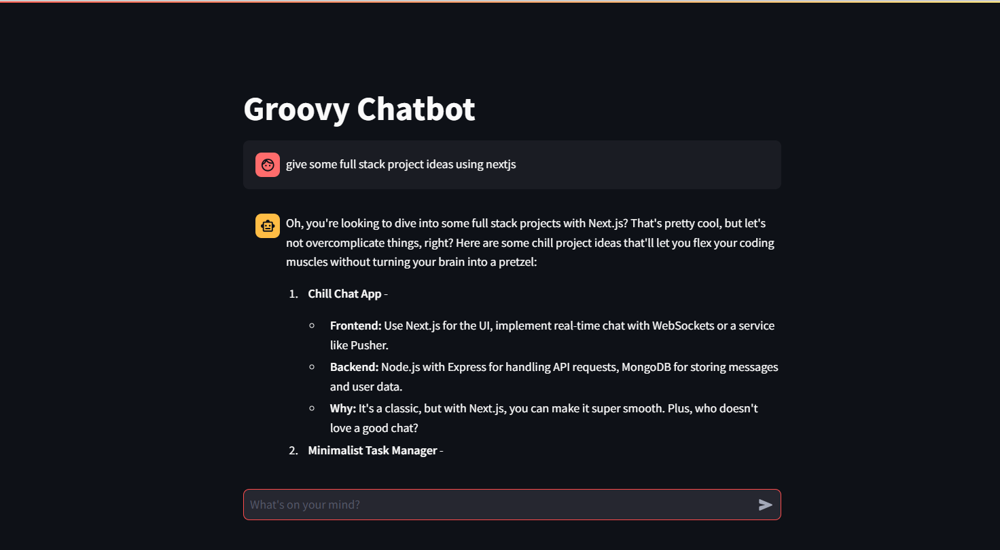

# Groovy Chatbot

This project implements a simple chatbot using Streamlit and the X.ai API. The chatbot is designed to emulate the personality of Oreki Houtarou from the anime "Hyouka," providing laid-back, insightful responses while encouraging users to think outside the box.

## Code Overview

### Imports

The code begins by importing necessary libraries:

- `os`: For accessing environment variables.
- `requests`: For making HTTP requests to the API.
- `streamlit`: For building the web application interface.

### API Configuration

The API URL and key are defined at the beginning of the script:

- `API_URL`: The endpoint for the X.ai chat completions API.
- `API_KEY`: The API key is retrieved from the environment variables for security.

### Function: `send_message`

This function is responsible for sending user messages to the X.ai API and returning the assistant's response.

- **Payload Preparation**: The function constructs a payload that includes the user message and a system message that defines the chatbot's behavior.
- **HTTP Request**: It sends a POST request to the API with the payload and headers.
- **Response Handling**: The function checks for a successful response and extracts the assistant's reply. If an error occurs, it returns an error message.

### Streamlit App Setup

The Streamlit app is set up with the following components:

- **Title**: The app is titled "Groovy Chatbot."
- **Session State**: It initializes a session state to store messages if it doesn't already exist.
- **Message Display**: Previous messages are displayed in the chat interface.
- **User Input**: A chat input box allows users to type their messages. When a message is submitted:
  - The user message is added to the session state.
  - The message is sent to the `send_message` function.
  - The assistant's response is displayed in the chat interface.

`streamlit run app.py`

### Error Handling

The app includes error handling to manage potential issues, such as:

- API request failures.
- Empty responses from the assistant.

## Conclusion

This chatbot provides a unique conversational experience by combining modern technology with a relatable character. Users can engage in thoughtful discussions while enjoying a relaxed atmosphere.
